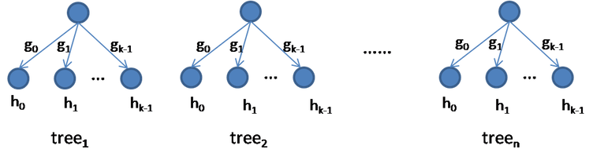

### Objective Function(active function and loss function)

- Classification
  - Binary classification
    - sigmoid(negtive log bernoulli likelihood)
    - sigmoid_cross_entropy
    - hinge(svm)
    - l2_hinge
    - smooth_hinge
    - exponential
  - Multi-class classification
    - softmax(negtive multinoulli likelihood)
    - softmax_cross_entropy
    - hsoftmax(hierarchical softmax)
    - hsoftmax_cross_entropy
    - multiclass_hinge
    - multiclass_l2_hinge
    - multiclass_smooth_hinge
- Regression
  - l2(mean squared error, least squares regression)
  - l1(mean absolute error, least absolute deviation regression)
  - huber
  - poisson
  - mape(mean absolute percentage error)
  - smape(symmetric mean absolute percentage error)
  - inv_mape(inv mean absolute percentage error)

The abbreviations of objective function listed above can be set via ```loss_function``` in model configuration.

### Models(score function)

- linear
- multiclass_linear
- fm(Factorization Machine)
- ffm(Field-aware Factorization Machine)
- gbdt(Gradient Boosting Decision/Regression Tree, Random Forest)
- gbmlr(Gradient Boosting Mixture Linear Tree model, Mixture Linear Random Forest Model)
- gbsdt(Gradient Goosting Soft Decision/Regression Tree Model, Soft Random Forest Decision/Regression Tree Model)
- gbhmlr(Gradient Boosting Hierarchical Mixture Linear Tree model, Hierarchical Mixture Linear Random Forest Model)
- gbhsdt(Gradient Boosting Hierarchical Soft Decision/Regression Tree Model, Hierarchical Soft Random Forest Decision/Regression Tree Model)

The abbreviation of model name listed above can be set via ```model_name``` in [running scripts](../bin).

**Linear Model:**
$$
f(\mathbf{x})=\mathbf{w}^T\mathbf{x}+b
$$
Various active function and loss function combined can generate different models(share same score function):

1. L2: linear model +  Identity active function + square loss
2. L1: linear model +  Identity active function  + absolute loss
3. Logistic Regression: linear model + sigmoid active function + negative log loss
4. Binary Cross Entropy: linear model + sigmoid active function + cross entropy loss
5. Hinge: linear model + Identity active function + hinge loss
6. ...


[configuration](linear.conf.md), [demo](../demo/linear), [reference](https://en.wikipedia.org/wiki/Linear_model).

**Multiclass Linear Model:**
$$
f_k(\mathbf{x})=\mathbf{w}_k^Tx,k=1,2,...,K
$$
Various active function and loss function combined can generate different models(share same score function):

1. Softmax: multiclass linear model + softmax active function + negative log loss
2. Multiclass Hingle:  multiclass linear model  + Identity active function + hinge loss
3. ...

[configuration](multiclass_linear.conf.md), [demo](../demo/multiclass_linear), [reference](http://vision.stanford.edu/teaching/cs231n-demos/linear-classify/)

**Factorization Machines(FM):**
$$
f(\mathbf{x})=b+\sum_{i=1}^n {w_i}{x_i} + \sum_{i=1}^n\sum_{j=i+1}^n \mathbf{v}\_i^T\mathbf{v}\_j{x_i}{x_j}
$$
A 2-way FM(degree d=2) contains linear part $b+\sum_{i=1}^n {w_i}{x_i}$  and pairwise interactions $ \sum_{i=1}^n\sum_{j=i+1}^n \mathbf{v}\_i^T\mathbf{v}\_j.{x_i}{x_j}$. Just like linear model, FM can be applied to regression and classification tasks. FM is a new model class that combines the advantages of SVM with factorization models and it can mimic lots of other different factorization models(MF, SVD, SVD++, FITF, FPMC ...) just by specifying the input data.

[configuration](fm.conf.md), [demo](../demo/fm), [reference](http://www.algo.uni-konstanz.de/members/rendle/pdf/Rendle2010FM.pdf)

**Field-aware Factorization Machines(FFM):**
$$
f(\mathbf{x})=b+\sum_{i=1}^n {w_i}{x_i} + \sum_{i=1}^n\sum_{j=i+1}^n \mathbf{w}_{i,{f_j}}^T\mathbf{w}_{j,{f_i}}{x_i}{x_j}
$$
FFM is a variant of FM, outperforming existing models in several world-wide CTR-prediction competitions. Just like FM, FFM can also be applied to regression and classification tasks(using different active function and loss function).

[configuration](ffm.conf.md), [demo](../demo/ffm), [reference](https://www.csie.ntu.edu.tw/~r01922136/slides/ffm.pdf)

**Gradient Boosting Decision Tree(GBDT or GBRT)**
$$
F_m(\mathbf{x}) =  F_{m-1}(\mathbf{x})  + \alpha f_m(\mathbf{x}) \\\ F_{m-1}(\mathbf{x})=\sum_{i=1}^{m-1}f_m(\mathbf{x})\\\ f_m(\mathbf{x})=\mathbf{w}_{q(\mathbf{x})}, q:R^d{\rightarrow}\{1, 2, ...,T\},\mathbf{w}{\in}R^T
$$
GBDT is a very effective machine learning method and is widely used in many machine learning tasks. This model is trained in an additive manner by greedily adding a new tree that decreases the objective(loss) function to the largest extent. 

In the above formulations, $f_m(\mathbf{x})$ is the tree and $q(\mathbf{x})$ represents the structure of the tree. It is a leaf index mapping function that maps an instance to the corresponding leaf index.  $\mathbf{w}$ is a vector of leaf values and $T$ is the number of leaves in the tree.  So $f_m(\mathbf{x})$  maps an instance to its corresponding tree leaf value.

[configuration](gbdt.conf.md), [demo](../demo/gbdt)

Reference:

1. Friedman, Jerome H. "Greedy function approximation: a gradient boosting machine." *Annals of statistics* (2001): 1189-1232.
2. Chen, Tianqi, and Carlos Guestrin. "Xgboost: A scalable tree boosting system." *Proceedings of the 22Nd ACM SIGKDD International Conference on Knowledge Discovery and Data Mining*. ACM, 2016.

**Gradient Boosting Soft Tree(GBST):**
$$
F_m(\mathbf{x}) =  F_{m-1}(\mathbf{x})  + \alpha f_m(\mathbf{x}) \\\ F_{m-1}(\mathbf{x})=\sum_{i=1}^{m-1}f_m(\mathbf{x}) \\\ f_m(\mathbf{x};W_g,W_s) = \sum_{k=1}^{K} g_m^k(\mathbf{x};\mathbf{w}_g^k)h_m^k(\mathbf{x};\mathbf{w}_s^k) \\\ (W_g,W_s)=\arg\min_{W_g^{'},W_s^{'}}L(F_{m-1}(\mathbf{x})  +  f_m(\mathbf{x};W_g^{'},W_s^{'}))
$$
$g_k(x)$ is gating function,  $h_k(x)$ is a basis score function, $f_m(x)$ is a soft tree model(also can be viewed as mixture model) and $F_m(x)$ is a score function constructed with additive tree model.

GBST is very similar with traditional gradient boosting decision tree. The following are the main differences:

1. $f_m$ is a parameterized function optimized with gradient based algorithm like L-BFGS, CG in GBST while $f_m$ is a rule-based function optimized with greedily constructed regression tree . 
2. Trees are axis alignments in GBDT while trees are arbitrary alignments in GBST.

 Two kinds of *gating functions* are provided: 

```Softmax Gating Function(SGF)```:
$$
g^k(\mathbf{x}) = \frac{e^{\mathbf{w}_k^T\mathbf{x}}{\sum_{i=1}^{K}e^{\mathbf{w}_i^T\mathbf{x}}}
$$



```Hierarchical Softmax Gating Function(HSGF)```:
$$
g^k(\mathbf{x})=\prod_{j=1}^L \sigma(2\delta(left\_child) - 1)
$$


$L$ is the length of path from root to leaf, $\delta$ is a indicator function and $\delta$ is a simoid function.

HSGF has stronger non-linear ability than SGF. Theoretically, HSGF can divide any complex space. GBST with SGF is tree stump with $K$ leaves.  HSGF is a complete binary tree, with no requirement of full binary tree. We will provide common binary tree in the future.

There are two basis *score function*s:

```Linear Score Function(LSF)```:
$$
h^k(\mathbf{x})=\mathbf{w}^T\mathbf{x}+b
$$
```Single Variable Score Function(SVSF)```:
$$
h^k(\mathbf{x}) = z
$$

|      |                Advantages                |              Disadvantages               |
| :--: | :--------------------------------------: | :--------------------------------------: |
| GBDT | Training/Inference is fast. In most dense feature scenes, its performance is better than GBST. | In sparse categorical feature scenes, GBDT can't handle it directly. |
| GBST | In most scenes, its performance is better than linear models, FM and FFM models.  Although, in most dense feature sceces, GBST is slightly worse than GBDT, but it can handle large sparse categorical features(e.g. ctr predicting, recommendation). GBST needs fewer trees than GBDT. Only one tree can do the trick in most cases. | With more parameters, training can be very slow. GBST is a non-convex model, so it is hard to tune. |

Different gating functions combined with different basis score functions can create different GBST models. Ytk-learn supports eight GBST models(2(gating function) * 2(score function) * 2(gradient_boosting or random_forest)):

1. ```gbmlr```(SGF + LSF), [configuration](gbmlr.conf.md), [demo](../demo/gbmlr)
2. ```gbsdt```(SGF + SVSF), [configuration](gbmlr.conf.md), [demo](../demo/gbsdt)
3. ```gbhmlr```(HSGF + LSF), [configuration](gbmlr.conf.md), [demo](../demo/gbhmlr)
4. ```gbhsdt```(HSGF + SVSF), [configuration](gbmlr.conf.md), [demo](../demo/gbhsdt)

GBST can also be applied to regression and classification tasks with different active functions and loss functions.

Reference:

1. Friedman, Jerome H. "Greedy function approximation: a gradient boosting machine." *Annals of statistics* (2001): 1189-1232.
2. Jordan, Michael I., and Robert A. Jacobs. "Hierarchical mixtures of experts and the EM algorithm." *Neural computation* 6.2 (1994): 181-214.

### Limits

Different models can be used with specified objective functions.

| Models            | Types of Objective Function              |
| :---------------- | :--------------------------------------- |
| linear            | Binary Classification/Regression         |
| multiclass_linear | Multiclass Classification                |
| fm                | Binary Classification/Regression         |
| ffm               | Binary Classification/Regression         |
| gbdt              | Binary Classification/Regression/Multiclass Classification |
| gbmlr             | Binary Classification/Regression         |
| gbsdt             | Binary Classification/Regression         |
| gbhmlr            | Binary Classification/Regression         |
| gbhsdt            | Binary Classification/Regression         |